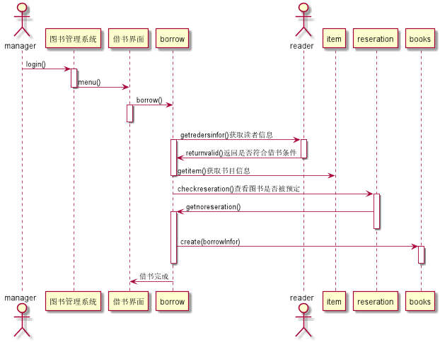
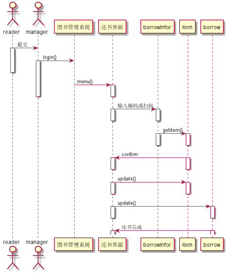
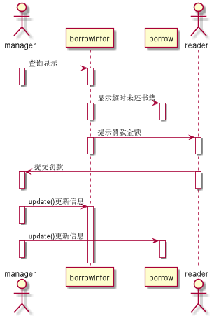

|学号|班级|姓名|
|:-------:|:-------------: |:----------:|
|201510414307|软件(本)15-3|李龙飞|
# 实验三：图书管理系统的顺序图
### 1借书用例
### 1.1借书用例PlantUML源代码
 <pre> 
@startuml
actor manager

manager->图书管理系统:login()
activate 图书管理系统

图书管理系统->借书界面:menu()
deactivate 图书管理系统

借书界面->borrow:borrow()
activate 借书界面
deactivate 借书界面
actor reader
borrow->reader:getredersinfor()获取读者信息
activate borrow
activate reader

reader->borrow:returnvalid()返回是否符合借书条件
deactivate reader
borrow->item:getitem()获取书目信息
deactivate borrow

borrow->reseration:checkreseration()查看图书是否被预定
activate reseration
reseration->borrow :getnoreseration()
activate borrow
deactivate reseration

borrow->books:create(borrowInfor)
activate books
deactivate books
deactivate borrow
borrow->借书界面:借书完成
@enduml
 </pre>

### 1.2借书用例顺序图

### 1.3借书用例图说明
<pre>
login()登陆系统，borrow()读者借书，gettitle（）获取书目信息，getreaders()获取读者信息，是否满足借书要求
getreservation()检查书记是借出，checkreseration()图书是否被预定，create(borrowInfor)建立借书信息
读者将书记给管理员登记，满足借书条件则借出成功
</pre>
### 2还书用例
### 2.1还书用例PlantUML源代码
<pre>
@startuml
actor reader
actor manager

reader->manager:提交
activate reader
manager->图书管理系统:login()
activate manager

deactivate reader
图书管理系统->还书界面:menu()
activate 还书界面
deactivate manager
deactivate 还书界面

还书界面->borrowInfor:输入编码或扫码
activate 还书界面
activate borrowInfor
deactivate 还书界面
 deactivate borrowInfor

borrowInfor->item:getitem()
activate borrowInfor
activate item
deactivate borrowInfor
deactivate item

item->还书界面:confirm
activate 还书界面
activate item
deactivate 还书界面
deactivate item

还书界面->item:update()
activate 还书界面
activate item
deactivate 还书界面
deactivate item

还书界面->borrow:update()
activate 还书界面
activate borrow
deactivate 还书界面
deactivate borrow

borrow->还书界面:还书完成
activate borrow
activate 还书界面
@enduml
</pre>
### 2.2还书用例顺序图

### 2.3还用例图说明
login()登陆系统，getitem()取得书条目信息，update()更新书籍信息何借阅信息
还书步骤：读者将书籍给管理员登记，查看图书完好后管理员通过扫码或输入编码进
行登记，跟新相关信息，还书成功

### 3罚款顺序图
### 3.1罚款用例顺序图PlantUML源码
<pre>
@startuml
actor manager

manager->borrowInfor:查询显示
activate manager
activate borrowInfor
deactivate manager
deactivate borrowInfor

borrowInfor->borrow:显示超时未还书籍
activate borrow
activate borrowInfor
deactivate borrow
deactivate borrowInfor

actor reader
borrowInfor->reader:提示罚款金额
activate reader
activate borrowInfor
deactivate reader
deactivate borrowInfor

reader->manager:提交罚款
activate reader
activate manager
deactivate reader
deactivate manager

manager->borrowInfor:update()更新信息
activate manager
activate borrowInfor
deactivate reader
deactivate manager

manager->borrow:update()更新信息
activate manager
activate borrow
deactivate manager
deactivate borrow

@enduml
</pre>
### 3.2罚款用例顺序图

###3.3罚款用例顺序图说明
管理员扫描书籍，发现超时记录，则按罚款规则进行计费，读者需要交付罚款，更新借阅信息
