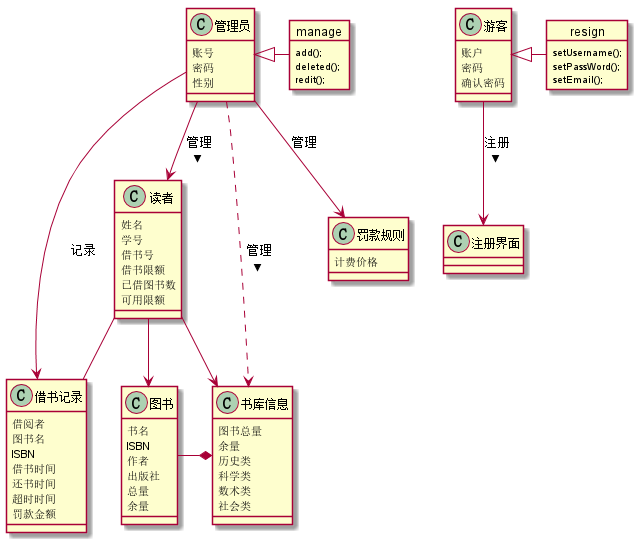
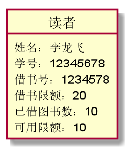
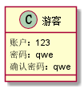

|        学号      |     班级    |    姓名    |
|:---------------:|:----------:|:-----  ----:|
|   201510414307   |    软工15-3 |    李龙飞  | 
#实验三：图书管理系统领域对象建模
###1.1类图代码
<pre>
@startuml
class 读者{
姓名
学号
借书号
借书限额
已借图书数
可用限额
}
class 管理员{
账号
密码
性别
}
class 游客{
 注册账户
 }
 class 图书{
 书名
 ISBN
 作者
 出版社
 总量
 余量
 }
 class 书库信息{
 图书总量
 余量
 历史类
 科学类
 数术类
 社会类
 }
class 借书记录{
借阅者
图书名
ISBN
借书时间
还书时间
超时时间
罚款金额
}
class 罚款规则{
计费价格
}
管理员 --> 读者 : 管理 >
管理员 ..> 书库信息 :管理 >
管理员->借书记录:记录
管理员-->罚款规则:管理
读者-->图书
读者->书库信息
读者--借书记录
游客-->书库信息:查看 >
图书-*书库信息
管理员<|- manage
object manage{
add();
deleted();
redit();
}
游客<|- resign
object resign{
setUsername();
setPassWord();
setEmail();
}
@enduml
</pre>
###1.2类图

###1.3类图说明
<pre>
上图是各个对象之间的关系表示及相关方法，其中包含读者类，管理员类，游客类，图书类，书库信息类，借书记录类
罚款规则类，manage方法类，resign方法类，管理员可以管理图书信息，书库信息，罚款规则，可以查看和保存借书记录，
读者可以查看图书信息，书库信息，游客可以查看书库信息，注册后可实现借书功能。
</pre>
<pre>
</pre>

##2图书管理系统对象图

###读者对象图源码
<pre>
@startuml
class 读者{
姓名：李龙飞
学号：201510414307
借书号：123456
借书限额：20
已借图书数：10
可用限额：10
}
@enduml
</pre>
###对象图

###管理员对象图源码
<pre>
@startuml
class 管理员{
账号：123
密码：123
性别：男
}
@enduml
</pre>
###对象图

###游客对象图源码
<pre>
@startuml
class 游客{
 注册账户
}
@enduml
</pre>
###对象图

###图书对象源码
<pre>
@startuml
class 图书{
书名：成都大学
ISBN:123_321-181-111
作者:成都市政府
出版社:中国
总量：100
余量：50
}
@enduml
</pre>
###对象图

###书库信息对象图源码
<pre>
@startuml
class 书库信息{
图书总量：100000000
余量:2000000
历史类:10000
科学类:10000
数术类:10000
社会类:10000
}
@enduml
</pre>
###对象图

###借书记录对象图源码
<pre>
@startuml
class 借书记录{
借阅者：李龙飞
图书名：你好
ISBN：123-132-12-122
借书时间：2018-4-16
还书时间：2018-4-17
超时时间：0
罚款金额：0
}
@enduml
</pre>
###对象图

###罚款规则对象图源码
<pre>
@startuml
class 罚款规则{
计费价格
}
@enduml
</pre>

