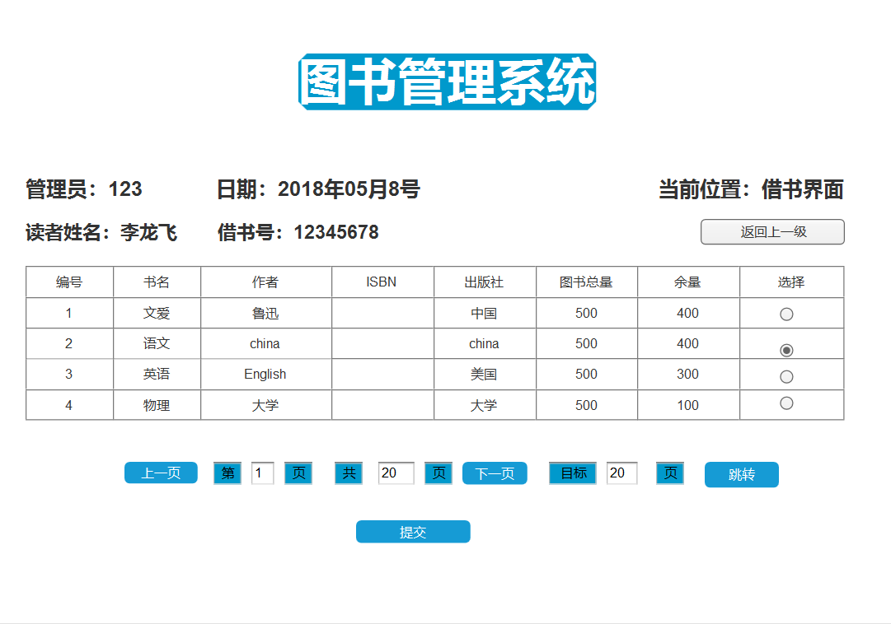
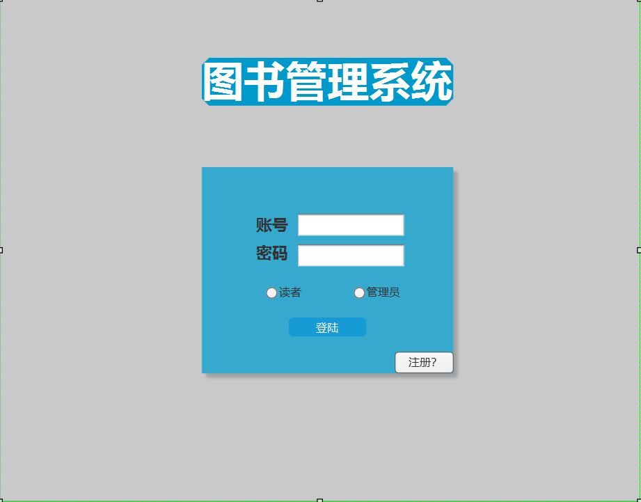

|学号|班级|姓名|
|:-------:|:-------------: | :----------:|
|201510414307|软件(本)15-3|李龙飞|
# 实验五:图书管理系统数据库设计与界面设计
## 1.数据表的设计
### 1.1读者类(tb_reader)     

| 字段 | 类型 | 主键或外键 | 可以为空 | 默认值 | 约束 | 说明 |  
| ---- | ---- | ---- | ---- | ---- | ---- | ---- |
|reader_name  |VARCHAR2(50 BYTE) |       |  否    |     |     | 读者姓名|
|reader_num   |NUMBER(11,0)      |       |  否    |     |     | 学号|
|stu_num      |NUMBER(11,0)      |  外键 |  否    |     |     | 学号,是借书记录表的外键|
|sum_limit   |UMBER(8,0)         |       |  是    |     |     | 借书限额 |
| uesed_limit | UMBER(8,0)       |       |  是    |     |     | 已借图书数  |
| usable_limit| UMBER(8,0)       |       |  是    |     |     | 可用额度    |

### 1.2管理员类(tb_manager)  

 | 字段 | 类型 | 主键或外键 | 可以为空 | 默认值 | 约束 | 说明 |  
 | ---- | ---- | ---- | ---- | ---- | ---- | ---- |
 | username|NUMBER(11,0)      |  主键 |  否    |     |     | 管理员账户|
 | password| VARCHAR2(50 BYTE)|       |  否    |     |     | 密码|
 | sex     |VARCHAR2(50 BYTE) |       |  否    |     |      | 性别|
 
### 1.3 图书类(tb_book)  
 
 | 字段 | 类型 | 主键或外键 | 可以为空 | 默认值 | 约束 | 说明 |  
 | ---- | ---- | ---- | ---- | ---- | ---- | ---- |
 | book_name| VARCHAR2(50 BYTE) |       |  否     |     |      | 书名|
 | ISBN     | VARCHAR2(50 BYTE) |       |  否     |     |      | ISBN国际标准书号|
 | author   | VARCHAR2(50 BYTE) |       |  否     |     |      | 书的作者|
 | publisher|VARCHAR2(50 BYTE)  |       |  否     |     |      | 出版社|
 |sum_num   |UMBER(8,0)         |       |  是     |     |      | 图书总量|
 |residue_num|UMBER(8,0)        |       |  是     |     |      | 图书余量|
 
### 1.4书库信息类（tb_library)  
 
 | 字段 | 类型 | 主键或外键 | 可以为空 | 默认值 | 约束 | 说明 |  
 | ---- | ---- | ---- | ---- | ---- | ---- | ---- |
 | sum_num    | UMBER(11,0) |    |  是  |   |    |  图书馆的书库总量 |
 | residue_num| UMBER(11,0) |    |  是  |   |    |  图书馆的书库余量 |
 | social      |UMBER(8,0)  |    |  是  |   |    |  社会类图书总量   |
 | historical | UMBER(8,0)  |    |  是  |   |    |  历史类类图书总量 |
 | mathematic | UMBER(8,0)  |    |  是  |   |    |  数学类图书总量   |
 | scientific | UMBER(8,0)  |    |  是  |   |    |  科学类图书总量   |  
 
### 1.5 借书记录类(tb_record_borrow)  
 
 | 字段 | 类型 | 主键或外键 | 可以为空 | 默认值 | 约束 | 说明 |  
 | ---- | ---- | ---- | ---- | ---- | ---- | ---- |
 | reader_name | VARCHAR2(50 BYTE) |    |  否   |    |    |  读者姓名 |
 | reader_num     | UMBER(11,0)    |    |  否   |    |    |  读者借书号|
 | book_name   | VARCHAR2(50 BYTE) |    |  否   |    |    |  图书名|
 | borrow_time | DATE              |    |  是   |    |    |  借书时间|
 | return_time | DATE              |    |  是   |    |    |  还书时间|
 | overtime    |VARCHAR2(50 BYTE)  |    |  是   |    |    |  超过规定还书日期的时间|
 | fine        |VARCHAR2(50 BYTE)  |    |  是   |    |    |  罚款金额|  
 
### 1.6罚款规则类(tb_fine_rule)  
 | 字段 | 类型 | 主键或外键 | 可以为空 | 默认值 | 约束 | 说明 |  
  | ---- | ---- | ---- | ---- | ---- | ---- | ---- |
  | price | VARCHAR2(50 BYTE) |    |    是   |    |    | 罚款计费价格|
  
### 1.7游客类(tb_regist)  
 | 字段 | 类型 | 主键或外键 | 可以为空 | 默认值 | 约束 | 说明 |  
  | ---- | ---- | ---- | ---- | ---- | ---- | ---- |
  | stu_number       | VARCHAR2(50 BYTE) |    |    否   |    |           | 注册账号|
  | password         |VARCHAR2(50 BYTE)  |    |    否   |    |           |注册密码 |
  | password_confirm |VARCHAR2(50 BYTE)  |    |    否   |    |           |注册密码的确认变量 |  
  
## 2.界面设计
### 2.1借书界面设计

- 用例图参见：借书用例
- 类图参见：借书记录类
- 顺序图参见：借书顺序图
- API接口如下：
1. 借阅信息API

- 功能：用于获取读者的借阅信息
- 请求地址： http://localhost:3306/BookManager/tb_record_borrow
- 请求方法：POST
- 请求参数：

|参数名称|必填|说明|
|:-------:|:-------------: | :----------:|
|reader_id|是|读者借书号|

- 返回实例：
```
{
    "status_code": "1/0",
    "data": 
    [
        {
            "book_name","123",
            "ISBN","123_123",
            "book_type","3",
            "author","123",
            "publisher","成大出版社",
            "price","123",
            "borrow_time","2018-05-08 23:59",
        },
    ]
}
```
- 返回参数说明：
    
|参数名称|说明|
|:-------:|:-------------: |
|status_code|状态码（1成功，0失败）|
|data|借阅信息的详细信息|

### 2.1借书界面设计  

- 用例图参见：管理员用例
- 类图参见：管理员类
- 顺序图参见：注册登陆顺序图
- API接口如下：

1. 登录API

- 功能：用于管理员登录
- 请求地址： http://localhost:3306/BookManager/tb_manager
- 请求方法：POST
- 请求参数：

|参数名称|必填|说明|
|:-------:|:-------------: | :----------:|
|username|是|管理员账户|
|password|是|密码|


- 返回实例：
```
{
    "status_code": "1/0"
}
```
- 返回参数说明：
    
|参数名称|说明|
|:-------:|:-------------: |
|status_code|状态码（1成功，0失败）|
 
